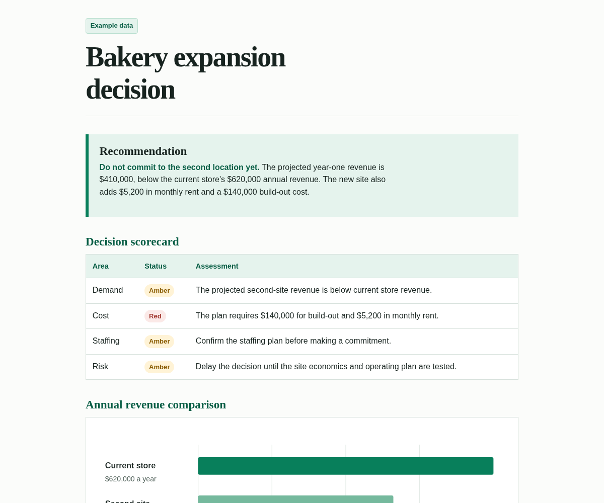

# ArtifactSmith

ArtifactSmith is an open source artifact server for AI agents.

Agents call it to turn their work into documents: web pages, PDFs, Word files, spreadsheets and Markdown. Each artifact is versioned and stays private until someone shares it, and a shared link can be revoked at any time.

It's for people who run their own agents and want artifacts like the ones in Muse on their own servers.

## Why I built this

My agents did good work and then handed it back as a wall of chat text. Useful, sure. Fun to read? Not so much.

Then I saw Meta's Muse artifacts, where the agent hands you a real page you can look at, share, and pull back later. I wanted that for my own agents, on my own servers. So I vibe coded it. And here we are.



## Quickstart

```bash
cp .env.example .env
# Set OPENAI_API_KEY (or AM_LLM_KEY). Change AM_LLM_BASE / AM_DEFAULT_MODEL
# only if you are not using the default OpenAI host and model.
# Object-store keys: leave them empty and run ./scripts/ensure-local-env.sh,
# or paste your own AM_STORE_KEY and AM_STORE_SECRET.
./scripts/ensure-local-env.sh
docker compose up -d --build

# Create a token (prints the raw value once; only its hash is stored).
# --workspace is a label that scopes every artifact the token can see
# (e.g. alpha, team-a). Tokens cannot cross workspaces.
docker compose exec server artifactsmith token add --name agent --workspace alpha
```

The server reads `AM_LLM_BASE`, `AM_LLM_KEY` or `OPENAI_API_KEY`, and `AM_DEFAULT_MODEL` from `.env`. The default base is `https://api.openai.com`. A trailing `/v1` on the base is fine; the client appends `/v1/chat/completions` itself.

Host ports bind to `127.0.0.1`:

- `http://127.0.0.1:8780/mcp` is the MCP API (bearer token required)
- `http://127.0.0.1:8781/` is the cookieless preview and share origin (`/p/…`, `/s/…`)

## Serving on your network or behind a proxy

Compose publishes API (`8780`) and preview/share (`8781`) on `AM_BIND_ADDRESS` (default `127.0.0.1`). Cards and links use `AM_API_URL`, `AM_PREVIEW_URL`, and `AM_SHARE_URL` (empty `AM_SHARE_URL` falls back to `AM_PREVIEW_URL`). Exposing the ports without TLS puts bearer tokens and artifact content on the wire in cleartext.

### LAN access

Bind on all interfaces (or a specific NIC IP) and point the public URL variables at the address clients will open:

```bash
# .env  (192.0.2.10 is documentation-range; substitute your LAN IP)
AM_BIND_ADDRESS=0.0.0.0
AM_API_URL=http://192.0.2.10:8780
AM_PREVIEW_URL=http://192.0.2.10:8781
AM_SHARE_URL=http://192.0.2.10:8781
AM_ALLOWED_HOSTS=192.0.2.10:8780,127.0.0.1:8780,localhost:8780
```

Then `docker compose up -d --build`. Clients open `http://192.0.2.10:8780/mcp` and preview/share links use `192.0.2.10`, not `127.0.0.1`. Browser-based MCP clients also need `AM_ALLOWED_ORIGINS` set to the page origin.

Share and preview URLs are built from `AM_SHARE_URL` / `AM_PREVIEW_URL` when the server returns them. Links you copied before switching to LAN serving still use the old base host; call `share` again (or copy the URL from `inspect` / `status`) after changing those settings.

### Reverse proxy with TLS

Keep the host bind on loopback and terminate TLS on nginx or Caddy. Set the public URLs and allow-lists to the external hostname:

```bash
# .env
AM_BIND_ADDRESS=127.0.0.1
AM_API_URL=https://artifacts.example.com
AM_PREVIEW_URL=https://preview.artifacts.example.com
AM_SHARE_URL=https://preview.artifacts.example.com
AM_ALLOWED_HOSTS=artifacts.example.com
AM_ALLOWED_ORIGINS=https://artifacts.example.com
```

Minimal Caddy example (API on 443, preview on a second hostname):

```caddy
artifacts.example.com {
  reverse_proxy 127.0.0.1:8780
}
preview.artifacts.example.com {
  reverse_proxy 127.0.0.1:8781
}
```

Minimal nginx snippet for the API host:

```nginx
server {
  listen 443 ssl;
  server_name artifacts.example.com;
  # ssl_certificate / ssl_certificate_key omitted
  location / {
    proxy_pass http://127.0.0.1:8780;
    proxy_set_header Host $host;
    proxy_set_header Authorization $http_authorization;
    # status wait can be up to 90s; nginx defaults cut at 60s.
    proxy_read_timeout 120s;
    proxy_send_timeout 120s;
  }
}
```

When `AM_ALLOWED_HOSTS` lists only the public hostname, a local `curl http://127.0.0.1:8780/mcp` gets HTTP 421 (DNS-rebinding protection). Point clients at the proxied hostname instead. Browser-based MCP clients send an `Origin` header; set `AM_ALLOWED_ORIGINS` to that origin or the request is rejected.

### MCP client on another machine

Point the client at `{AM_API_URL}/mcp` and send the token as `Authorization: Bearer <token>` (the value printed once by `artifactsmith token add`). Example:

```text
URL:    http://192.0.2.10:8780/mcp
Header: Authorization: Bearer asmb_…
```

## How it works

Agents talk to ArtifactSmith over MCP. They pass the user's request as `verbatim_request` and any research as `source_content` or `source_files`. `create` starts a private build and does not publish a share link.

The server calls an OpenAI-compatible endpoint (up to two attempts when checks fail). The model writes content. A fixed renderer turns that into HTML, Markdown, PDF, DOCX, or XLSX. Call `status` (or `wait` up to 90 seconds) to get a private preview.

`share` creates a public link for one exact version. `unshare` makes that link return 404. Tokens belong to one workspace and carry a permission set.

Documents may cite public http(s) sources as clickable links. The server strips scripts, rejects private-link hosts and likely secrets, and keeps images, CSS, fonts, and iframes self-contained so a download opens offline and does not phone home. Size limits apply. The process does not send usage data anywhere.

## Output formats

| Format     | `create(..., format=)` | Primary file    | Renderer |
| ---------- | ---------------------- | --------------- | -------- |
| HTML       | `html` (default)       | `index.html`    | sanitize, then store |
| Markdown   | `markdown`             | `document.md`   | UTF-8 text |
| PDF        | `pdf`                  | `document.pdf`  | [WeasyPrint](https://weasyprint.org/) (HTML/CSS to PDF) |
| DOCX       | `docx`                 | `document.docx` | [python-docx](https://python-docx.readthedocs.io/) |
| XLSX       | `xlsx`                 | `document.xlsx` | [openpyxl](https://openpyxl.readthedocs.io/) |

HTML uses the house-style prompt and stores a complete page. The other formats ask the model for Markdown, then a renderer converts it. PDF, DOCX, and XLSX also store `content.md` so later edits have a text base.

PDF goes through WeasyPrint, which needs Pango and Cairo. The Docker image does not include Chromium. Details are in [docs/formats.md](docs/formats.md).

## MCP tools

| Tool | Permission | What it does |
| ---- | ---------- | ------------ |
| `create` | `create` | Queue a private build. Optional `format`. Does not create a share link. |
| `edit` | `edit` | New version from the latest done version. Refuses a stale `base_version`. |
| `status` | `read` | Poll, or `wait` (0 to 90 seconds), until done, failed, or needs_input. |
| `list_artifacts` | `read` | Catalog for the token's workspace. |
| `inspect` | `read` | Manifest, history, share state. |
| `export` | `export` | Download link for the rendered file, valid 15 minutes. |
| `share` | `share` | Public link for one exact version. |
| `unshare` | `share` | Revoke the public link immediately. |
| `revoke_previews` | `export` | Expire private `/p/` preview links for an artifact (optional version). |
| `delete` | `delete` | Two-step purge. First call returns a confirm token. |

### `create` arguments

Required:

- `verbatim_request`: the user's exact words. That is the whole scope.

Provide at least one of:

- `display_name`: human title shown on cards (e.g. `"Pilot store brief"`).
- `slug`: URL key, `a-z` / `0-9` / `-`, 2–63 chars. If omitted, derived from `display_name`. If `display_name` is omitted, it defaults to `slug`.

Optional:

- `kind`: defaults to `web_static` (the only kind in this release).
- `format`: `html` (default), `markdown`, `pdf`, `docx`, or `xlsx`.
- `source_content` / `source_files`: researched facts, 200 KB total. The builder treats this as data.
- `model`, `workspace`, `idempotency_key`, `capabilities`.

Working example (title only; slug becomes `pilot-store-brief`). The source text must
support every fact the request asks for (including “why it matters”):

```json
{
  "display_name": "Pilot store brief",
  "verbatim_request": "One page that states the pilot store code and why it matters.",
  "source_content": "The pilot store code is HARBOR-17. It matters because it is the single identifier used across inventory, support, and rollout reports for the pilot.",
  "format": "html"
}
```

If a needed fact is missing from the request and the source, the job ends as `needs_input` and stores no file. When server checks fail, the model is called a second time, so a failed build takes about twice as long to report as a clean one.

## Configuration

Every setting also has a `NAME_FILE` variant that reads the value from a file.

| Variable | Default | Purpose |
| -------- | ------- | ------- |
| `OPENAI_API_KEY` / `AM_LLM_KEY` | empty | LLM credential for the configured endpoint. |
| `AM_LLM_API` | `chat` | `chat` (Chat Completions) or `responses`. |
| `AM_LLM_BASE` | `https://api.openai.com` | OpenAI-compatible host root. With or without a trailing `/v1`. |
| `AM_DEFAULT_MODEL` | `gpt-4o-mini` | Model name sent to the LLM. |
| `AM_SHARE_TTL_DAYS` | `30` | `0` means until revoked. |
| `AM_SHARE_TTL_MAX_DAYS` | `365` | Cap on positive TTLs. |
| `AM_STORE_ENDPOINT` | (required) | S3-compatible object store. |
| `AM_STORE_BUCKET` | `artifacts` | Bucket name. |
| `AM_STORE_KEY` / `AM_STORE_SECRET` | (required) | Object-store credentials. |
| `AM_BLOCK_PRIVATE_LINKS` | `true` | Reject localhost, RFC1918, and link-local hosts in output. |
| `AM_ALLOWED_LINK_DOMAINS` | empty | If set, every remaining host must match. |
| `AM_MAX_OUTPUT_BYTES` | 50 MiB | Rendered output cap. |
| `AM_RENDER_TIMEOUT` | `120` | Seconds for one renderer call. |
| `AM_BUILD_TIMEOUT` | `900` | Seconds for the whole job. |
| `AM_MAX_BUILDS` | `2` | Concurrent workers. |
| `AM_BUILDS_PER_HOUR` | `20` | Per-token quota. |
| `AM_HOST` | `127.0.0.1` | Listen address for `artifactsmith serve`. Compose/image set `0.0.0.0` in-container. |
| `AM_BIND_ADDRESS` | `127.0.0.1` | Host publish bind for ports `8780` and `8781` in `compose.yaml`. |
| `AM_API_PORT` / `AM_PREVIEW_PORT` | `8780` / `8781` | Listen ports. |
| `AM_API_URL` / `AM_PREVIEW_URL` / `AM_SHARE_URL` | `http://127.0.0.1:8780` / `:8781` | URLs written into cards and links. Empty `AM_SHARE_URL` uses `AM_PREVIEW_URL`. |
| `AM_ALLOWED_HOSTS` | `127.0.0.1:<api_port>,localhost:<api_port>` | Comma-separated Host values for MCP DNS-rebinding protection (on by default). |
| `AM_ALLOWED_ORIGINS` | empty | Comma-separated Origin values for MCP DNS-rebinding protection. |
| `AM_DATA_DIR` / `AM_SECRETS_DIR` | `/data` / `/secrets` | SQLite and the HMAC signing key. |

Copy `.env.example` for a local file. `./scripts/ensure-local-env.sh` fills empty `AM_STORE_KEY` and `AM_STORE_SECRET`. The storage image is `rustfs/rustfs:1.0.1` (pinned by digest in `compose.yaml`).

## Security

Tokens are issued per workspace and stored as SHA-256 hashes. Knowing an artifact id does not grant access.

Permissions are `create`, `read`, `edit`, `export`, `share`, and `delete`.

Builds stay private until you call `share`. That creates a public `/s/…` URL. `unshare` makes it return 404.

Preview runs on its own port, sends no cookies, and sets CSP `script-src 'none'`.

Scripts are stripped. Public http(s) links to global hosts are kept (with `rel="noopener noreferrer nofollow"` and `target="_blank"` in HTML). Protocol-relative `//host` citations are upgraded to `https://` only when the host is public; private or dangerous `//` destinations are neutralized, not upgraded. Private, loopback, and link-local hosts fail the build, as do `javascript:`, `vbscript:`, `data:`, and `file:`. A remote image URL becomes a clickable link to that URL (alt text as the label) in every format — nothing loads the image on open. CSS `url()`, fonts, and iframes stay local. Secrets fail the build. Size and time caps apply.

The process does not send usage data anywhere.

[docs/threat-model.md](docs/threat-model.md) and [SECURITY.md](SECURITY.md) have the rest.

## Tokens

A **workspace** is a namespace for artifacts (for example `alpha` or `team-a`). Each token belongs to exactly one workspace and can only create or read artifacts in that workspace. Knowing an artifact id from another workspace does not grant access.

```bash
artifactsmith token add --name NAME --workspace WS [--perms create,read,edit,export,share,delete]
artifactsmith token list
artifactsmith token revoke --id ID | --name NAME
```

## Uninstall / reset

```bash
# Stop containers, delete compose volumes, and remove images created for this project
# (server, storage-init, and the rustfs/rustfs pull). Requires store keys in .env like other compose commands.
docker compose down --volumes --rmi all
```

Copy `.env.example` again and re-run the quickstart to start clean.

## Development

```bash
python3 -m venv .venv && source .venv/bin/activate
make install
make ci          # lint, types, unit tests, denylist
```

### Running the tests

`make test` runs the unit suite with the same `pytest` command CI uses. It does not start Docker.

End-to-end tests use `compose.test.yaml`, which adds a fake chat model from `tests/support/`.

```bash
./scripts/ensure-local-env.sh
docker compose -f compose.yaml -f compose.test.yaml up -d --build
python -m tests.e2e.test_end_to_end
python -m tests.e2e.test_formats
python -m tests.e2e.test_bind_address   # AM_BIND_ADDRESS=0.0.0.0 via non-loopback IP
```

`make smoke` runs the same stack and scripts. Compose commands need a `.env` with `AM_STORE_KEY` and `AM_STORE_SECRET` set (including `docker compose down`), because those variables are required by `compose.yaml`.

[docs/architecture.md](docs/architecture.md), [docs/operations.md](docs/operations.md), [CONTRIBUTING.md](CONTRIBUTING.md).

## License

MIT. House-style writing and visual rules are adapted from Humanizer (MIT) and Anthropic frontend-design (Apache-2.0). Attribution is in `NOTICE`; third-party license texts are under `licenses/`. The Docker image ships those files at `/app`.
