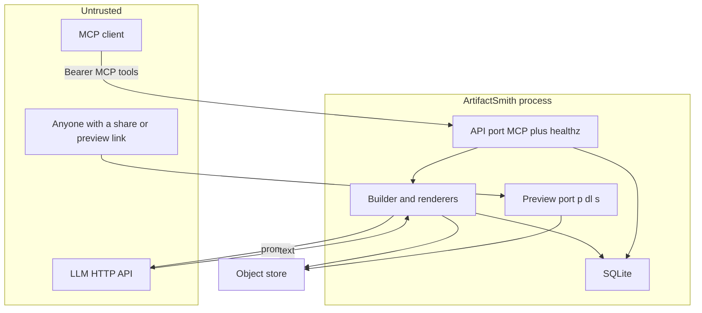

# ArtifactSmith threat model (PR #2 head `a2b873c`)

Assumptions: single compose replica, host ports on loopback, bearer tokens, model output hostile. No operator follow-up.

## System

Python 3.11+ MCP server (`FastMCP` + uvicorn) plus a second cookieless Starlette origin. SQLite is the source of truth. Bytes live in S3-compatible storage (rustfs in compose). The builder calls an LLM and runs a fixed renderer.

Evidence: `src/artifactsmith/server.py`, `service.py`, `builder.py`, `db.py`, `store.py`, `compose.yaml`.

## Entry points

| Surface | Auth | Evidence |
|---|---|---|
| MCP tools `create` `edit` `status` `list_artifacts` `inspect` `export` `share` `unshare` `revoke_previews` `delete` | Bearer, hashed SHA-256, workspace + perms | `server.py` tools; `BearerAuth` |
| HTTP `/healthz` on both ports | None | `server.py:262` |
| HTTP `/p/{token}` preview | Unauthenticated short id | `server.py:289` |
| HTTP `/dl/{token}` download | HMAC token, 15 minutes | `server.py:302`, `service.sign` |
| HTTP `/s/{sid}` share | Unauthenticated, pin sha256 | `server.py:313` |
| CLI `serve` `token` `storage-init` | Operator shell | `cli.py` |
| Env / `NAME_FILE` | Operator | `config.py` |
| Model text | Untrusted | `llm.py`, `builder.run_build` |

Out of scope: tests, `fake-chat-llm`, Dependabot, CI.

## Assets

Workspace artifacts and source bundles. Bearer tokens (shown once). HMAC signing key (`secrets_dir/signing.key`). Object-store keys. Public share URLs. Card fields (title, summary, assumptions).

## Trust boundaries

1. MCP client → API: bearer + optional DNS-rebinding allow-list (off by default).
2. Anyone → preview origin: capability URL only; CSP `script-src 'none'` and sandbox. Downloads have no CSP.
3. Process → LLM: TLS/HTTP as configured; output is data, never executed.
4. Process → object store: keys from env. Store has no published compose ports.
5. Model text → stored bytes: sanitizer, secret/private-link checks, size/time limits.

## Attackers

Token holder in workspace A. Token holder in workspace B. Anyone who obtains `/s/…`. Anyone who can reach published ports. The LLM (prompt injection, hostile HTML/CSS/formulas). A careless operator (defaults, `latest` tags).

Non-capabilities: no in-workspace ACLs to break; no claim that a compromised LLM host is in scope.

## Abuse paths

| ID | Goal | Path | Likelihood | Impact | Priority |
|---|---|---|---|---|---|
| T1 | XSS in standalone export | Model HTML with style/script breakout | Low (sanitizer held in Chrome) | High if it worked (no CSP on download) | Residual low |
| T2 | Point a card at a private host | Model summary with `http://127.1/` or sslip.io | Medium | Medium (browser CSRF / metadata from the operator) | Medium |
| T3 | Formula injection | `=` cells in XLSX | Low (cells forced strings) | Medium if Excel ran them | Residual low |
| T4 | Cross-workspace read | Guess artifact id | Low (workspace check) | High | Residual low |
| T5 | Guess preview/share | Short ids | Low (50–80 bits + expiry) | Medium | Residual low |
| T6 | LAN expose | `serve` on `0.0.0.0` | Medium for non-compose | Medium | Medium |
| T7 | Store takeover | `rustfs:latest` moves | Low | High | Low |
| T8 | Delete/upload race | Concurrent delete and building upload | Low in one process | Medium (orphans / resurrected rows) | Residual low |
| T9 | DoS | Huge model output / hung render | Low (caps + killable child) | Medium | Residual low |

## Existing mitigations

Allowlist HTML (nh3) and CSS (tinycss2). CSP on hosted preview. Secret and private-link heuristics. Formula cells written as strings. `BEGIN IMMEDIATE` job claim. `deleting_at` + refuse delete while `building`. HMAC downloads. Share pins sha256. Tokens hashed. Compose loopback publish. Render subprocess timeout and `RLIMIT_AS`.

## Recommended mitigations

Tighten `_host_is_private` (finding 1). Default `AM_HOST=127.0.0.1` and default MCP Host allow-list (findings 2–3). Pin rustfs (finding 4). Do not return store exceptions from `inspect` (finding 5).

Open questions: internet exposure beyond compose, multi-replica SQLite, whether MCP clients auto-linkify card URLs.
EOF